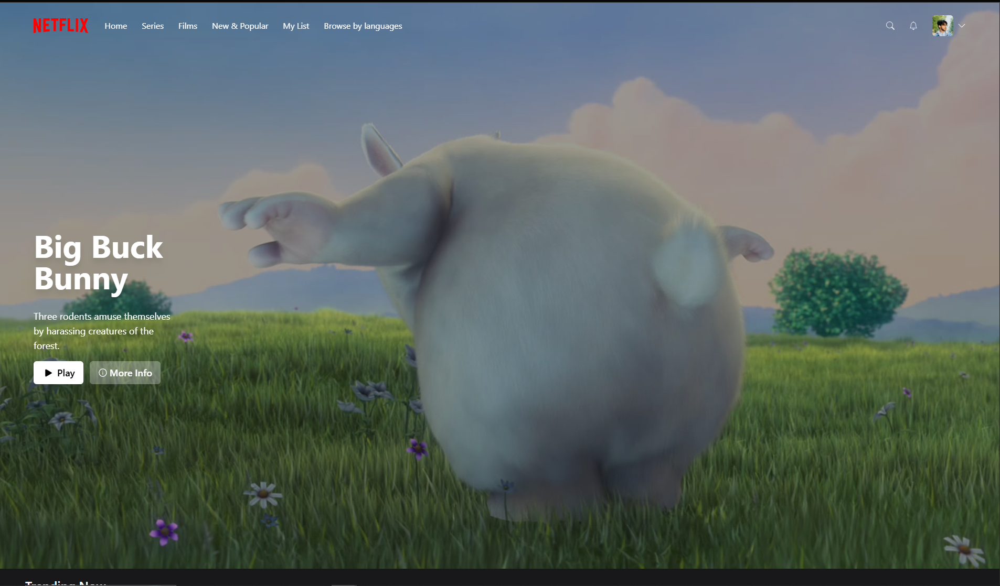

# 🎬 Netflix Clone

A beautiful Netflix UI clone built with modern frontend tools. Browse movies, watch previews, and enjoy a clean responsive interface powered by the TMDb API.

[](https://netflix-clone-beta-one-61.vercel.app/)

---

## 🚀 Features

- Browse popular & trending movies
- View detailed movie pages
- Play trailers via YouTube integration
- Responsive and mobile-friendly layout
- Fast Vite-based development
- Clean and reusable components

---

## 🛠 Tech Stack

| Category        | Tool / Library                                     |
|-----------------|----------------------------------------------------|
| Framework       | [React](https://reactjs.org/)                      |
| Build Tool      | [Vite](https://vitejs.dev/)                        |
| Styling         | [Tailwind CSS](https://tailwindcss.com/)           |
| State Management| [Zustand](https://github.com/pmndrs/zustand)       |
| Data Fetching   | [SWR](https://swr.vercel.app/), [axios](https://axios-http.com) |
| Type Checking   | [PropTypes](https://reactjs.org/docs/typechecking-with-proptypes.html) |
| Icons           | [React Icons](https://react-icons.github.io/react-icons/) |
| Routing         | [React Router DOM](https://reactrouter.com/)       |
| API             | [TMDb API, Open APIs](https://www.themoviedb.org/documentation/api) |

---

## 📦 Installation

1. **Clone the repo**

```bash
git clone https://github.com/by-durrani/netflix-clone.git
cd netflix-clone
