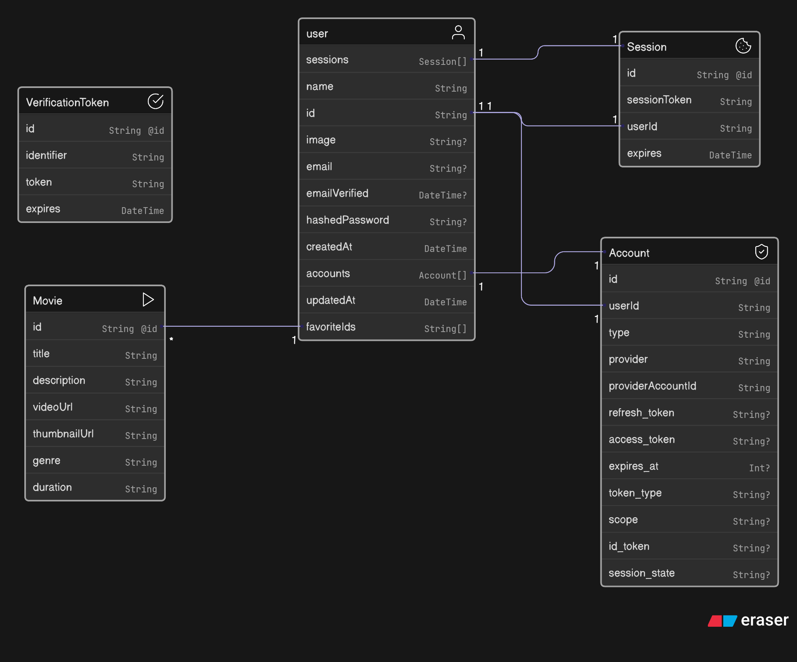

# 🎬 Netflix Clone

A beautiful Netflix UI clone built with modern frontend tools. Browse movies, watch previews, and enjoy a clean responsive interface powered by the TMDb API.

[](https://netflix-clone-beta-one-61.vercel.app/)

---

## ✨ Features

- Browse popular & trending movies
- View detailed movie pages
- Play trailers via YouTube integration
- User authentication with NextAuth
- Responsive and mobile-friendly layout
- Fast development powered by Next.js (Turbopack)
- Clean and reusable components
- State management with Zustand
- Data fetching with SWR

---

## 🛠 Tech Stack

| Category            | Tool / Library                                              |
|---------------------|-------------------------------------------------------------|
| Framework           | [Next.js 15 (Turbopack)](https://nextjs.org/)              |
| Authentication      | [NextAuth.js](https://next-auth.js.org/)                   |
| Database            | [MongoDB](https://cloud.mongodb.com/)                   |
| ORM / DB Access     | [Prisma](https://www.prisma.io/)                            |
| Database Adapter    | [@next-auth/prisma-adapter](https://authjs.dev/reference/adapter/prisma) |
| Password Hashing    | [bcrypt](https://github.com/kelektiv/node.bcrypt.js/)       |
| State Management    | [Zustand](https://github.com/pmndrs/zustand)                |
| Data Fetching       | [SWR](https://swr.vercel.app/)                              |
| HTTP Requests       | [Axios](https://axios-http.com/)                            |
| UI Styling          | [Tailwind CSS](https://tailwindcss.com/) + [tailwindcss-animate](https://www.npmjs.com/package/tailwindcss-animate) |
| Icons               | [React Icons](https://react-icons.github.io/react-icons/)   |
| Utility Functions   | [Lodash](https://lodash.com/)                               |
| Linting             | [ESLint](https://eslint.org/)                               |
| Language Support    | [TypeScript](https://www.typescriptlang.org/)               |

---

## Entity Relashionship Diagram



## 📦 Installation

1. **Clone the repo**

```bash
git clone https://github.com/by-durrani/netflix-clone.git
cd netflix-clone
